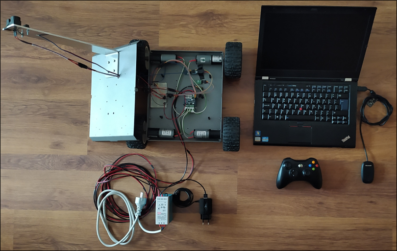
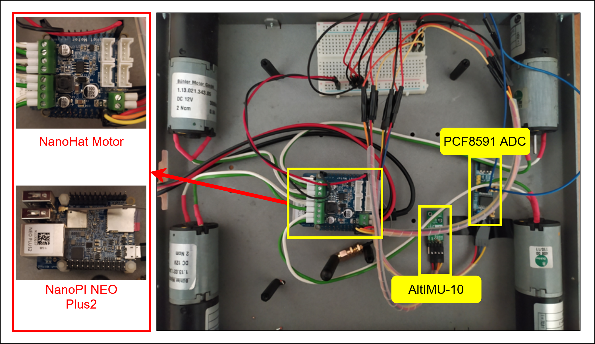
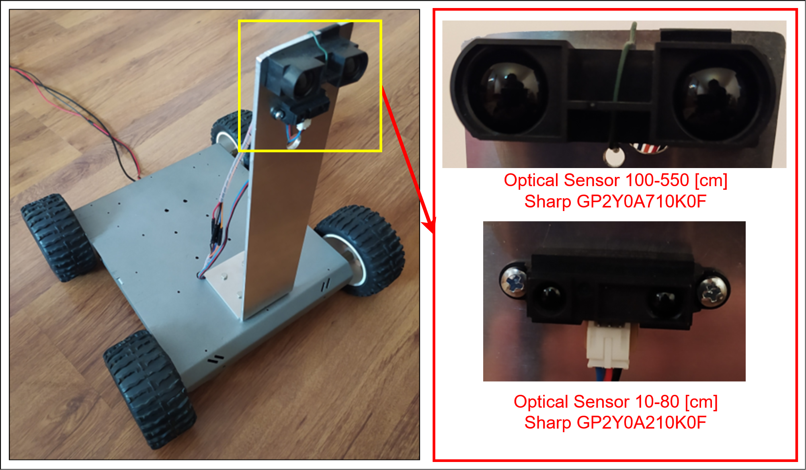
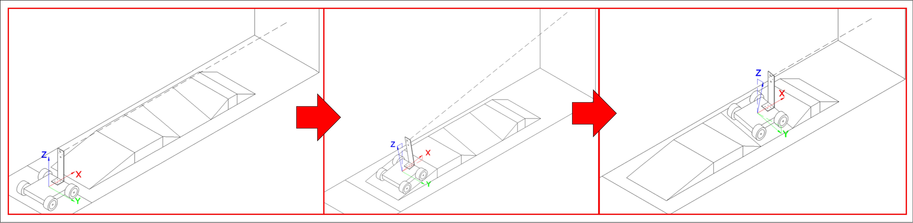
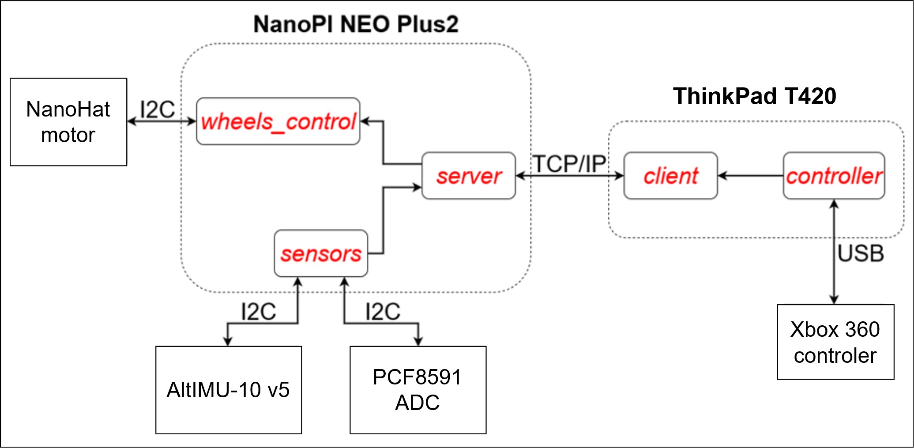

# 4-wheeled mobile robot

## Description
  The goal of the project is to develop simple mobile robot
 which is capable of reciving, sending and processing data from
 various sensors and devices.

 | LIST OF DEVICES:           |     APPLICATION:     
 |------------------          |----------------------
 | SBC board NanoPi NEO PLUS2 |   system control   
 | PCF8591                    |         ADC          
 | Sharp GP2Y0A21YK0F         | analog optical sensor 10-80 [cm] 
 | Sharp GP2Y0A710K0F         | analog optical sensor 100-550 [cm] 
 | Altimu-10-v5               | mobile robot orientation via accelerometer
 | NanoHat-Motor              |  DC motor controller 

*Figure 1. Test stand* 

*Figure 2. Ineternals of mobile robot* 

*Figure 3. Optical Sensors* 

*Figure 4. Operation principals* 

*Figure 5. Program diagram* 

---

## Functionality
 User should be able to:
  - connect to SBC via Ethernet or Wi-Fi
  - recieve processed data from SBC
  - control movement of the platform

## Tools used
* gcc for ARM/x86_64 processors

---

## Instalation
* Software requirements:
    - `gcc` for SBC (ARM based)
    - `gcc` for host computer (x86_64 based)
* In order to compile all files run `make` in main folder (it may be necessary to change CC_ARM and CC_x86_64 variables in `Makefile` to match paths to compilers).
It will result in getting 4 folders:
    - `/bin_arm`    - exec files for arm based SBC minicomputer (server, sensors, wheels_control)
    - `/bin_x86_64` - exec files for x86_64 based host computer (client, controller)
    - `/obj_arm`    - object files for arm based SBC minicomputer
    - `/obj_x86_64` - object files for x86_64 based host computer
* In order to send files to SBC minicomputer connect to via hotspot or directly via ethernet cable.
* Then the send.sh bash script can be used to send files to SBC.
Example: 
     - `./send.sh 172.24.1.1` (Change ip to ip of yours SBC.)
* To start the system, first you should connect to SBC. Use connect.sh bash script.
Example:
     - `./connect.sh 172.24.1.1` (Change ip to ip of yours SBC.)
* Run the "server" program on SBC. Then run the "client" program on host computer. The system should be know ready to work.